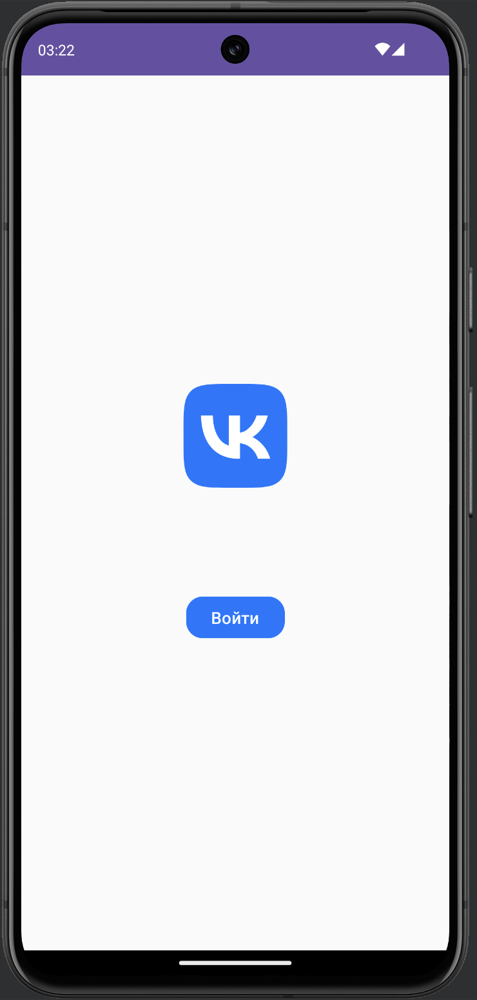
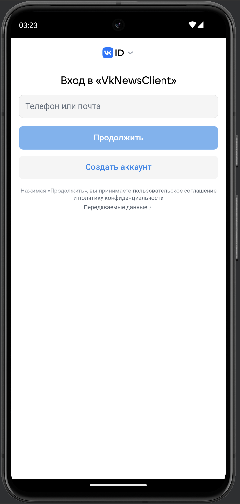

# VkNewsClient

**VkNewsClient** — это учебное Android-приложение, разработанное для работы с [VK API](https://dev.vk.com/ru/reference). Приложение предоставляет пользователям возможность авторизоваться через VK, просматривать посты из рекомендаций, оценивать их, оставлять комментарии, а также видеть статистику взаимодействий (лайки, репосты и комментарии).

## Основные функции

- **Авторизация через VK**: Пользователь может войти в систему через свой аккаунт VK.
- **Лента рекомендаций**: Приложение отображает список постов из рекомендаций VK.
- **Взаимодействие с постами**: Пользователь может ставить лайки на постах и просматривать статистику взаимодействий (лайки, комментарии, репосты).
- **Комментарии**: Возможность просматривать комментарии к постам.

## Стек используемых библиотек

Приложение разработано с использованием следующих библиотек:

- **Dagger**: Для внедрения зависимостей (Dependency Injection).
- **Coil**: Для загрузки изображений с поддержкой Jetpack Compose.
- **Retrofit**: Для взаимодействия с VK API.
- **VK Android SDK**: Для работы с VK API (авторизация и получение данных).
- **Gson**: Для сериализации и десериализации данных, полученных от VK API.
- **Jetpack Compose**: Для создания пользовательского интерфейса.
- **Navigation (Compose)**: Для навигации между экранами.
- **Coroutine Flow**: Для работы с асинхронными потоками данных.

## Скриншоты
  
